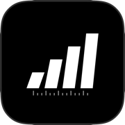
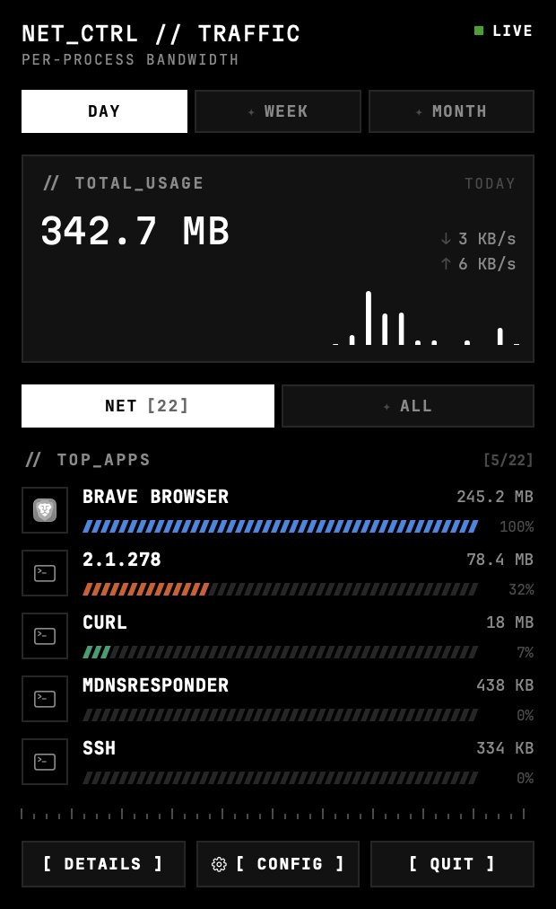
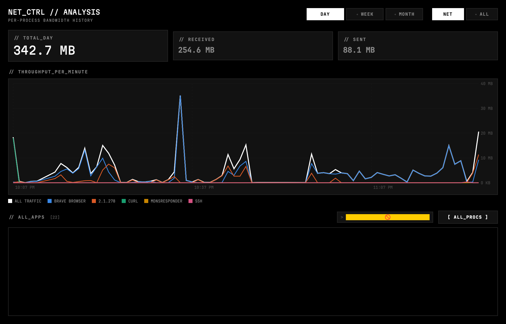
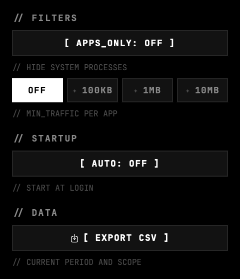

<div align="center">



# Network Monitor

**Per-app bandwidth monitoring in the macOS menu bar.**

macOS can tell you how much data you're using right now. It can't tell you which app
used 4 GB last Tuesday. This does.

[**Download for macOS**](https://github.com/reachforaryan/network-monitor/releases/latest)
· Apple Silicon · macOS 14+

</div>

---

<div align="center">

</div>

Live throughput sits in the menu bar. Click it for today's total, the last minute of
activity, and the five apps using the most — switchable between day, week and month, and
between internet-only and all traffic (which includes loopback and local connections).

## What it does

- **Attributes traffic to apps**, not just interfaces. Helper processes roll up under
  their parent, so all of Chrome's renderers count as Chrome.
- **Keeps history** — minute resolution for a week, hourly and daily for over a year, in
  a local SQLite file.
- **Runs light.** ~1% CPU, ~70 MB, no background daemon, no kernel extension.
- **Stays local.** Nothing leaves the machine. No network calls, no telemetry, no account.

<div align="center">

</div>

The detail window charts total throughput against the top apps over the selected period,
and lists every process that moved a byte.

<div align="center">

</div>

Filters keep the list useful: hide system daemons, set a minimum traffic threshold, or
search by name. Filters never change the totals — hiding `mDNSResponder` shouldn't make
your machine look like it used less than it did, so the headline figures stay honest and
the list header reads `[4/22]`.

## Install

Download the [latest release](https://github.com/reachforaryan/network-monitor/releases/latest),
unzip, and drag to Applications.

The app is ad-hoc signed, not notarized, so Gatekeeper will object the first time.
Right-click it → **Open** → **Open**, or:

```sh
xattr -dr com.apple.quarantine /Applications/NetworkMonitor.app
```

No permission prompts — it needs no special access.

## How it works

Traffic comes from `nettop`, the per-process network tool built into macOS, sampled every
two seconds. Counters are cumulative, so usage is the difference between samples, written
to SQLite in batches.

This avoids Apple's `NetworkExtension` content-filter API, which would need a
system extension, an entitlement from Apple, and a permission prompt — a lot of
machinery for a personal widget. The tradeoff: a process that both starts and exits
between two samples is invisible, and a process is credited from the moment it's first
seen rather than from launch.

## Build from source

```sh
git clone https://github.com/reachforaryan/network-monitor.git
cd network-monitor
./Scripts/build-app.sh && open NetworkMonitor.app
```

Requires Swift 6 and the Xcode command line tools. `swift test` runs the suite;
`swift run` is enough for development, though the Dock icon and login item only work
from the built bundle.

## Licence

Code is MIT. Bundles [JetBrains Mono](https://github.com/JetBrains/JetBrainsMono) and
[Martian Mono](https://github.com/evilmartians/mono), both SIL OFL 1.1, with their
licences included.
